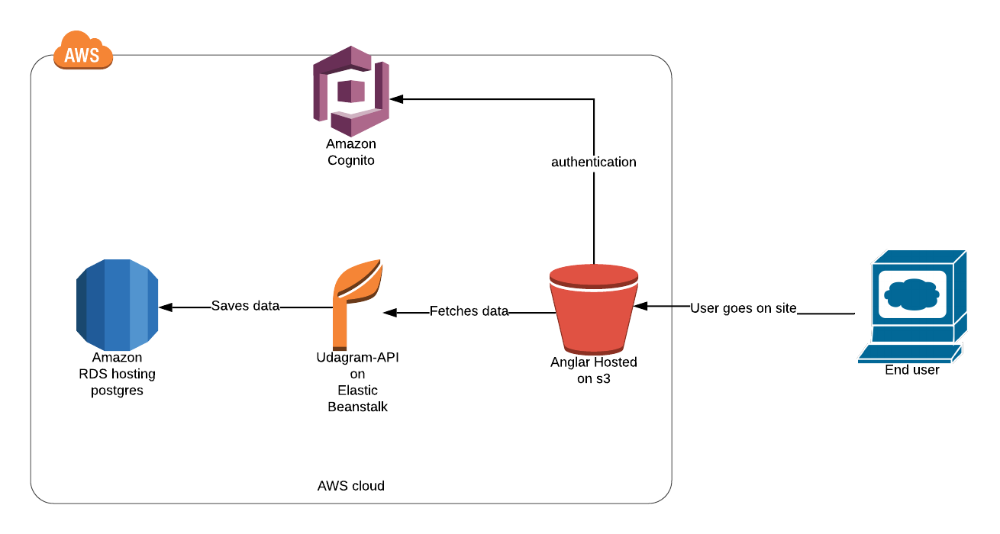
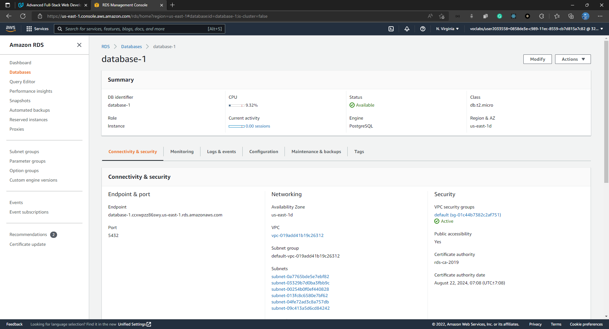
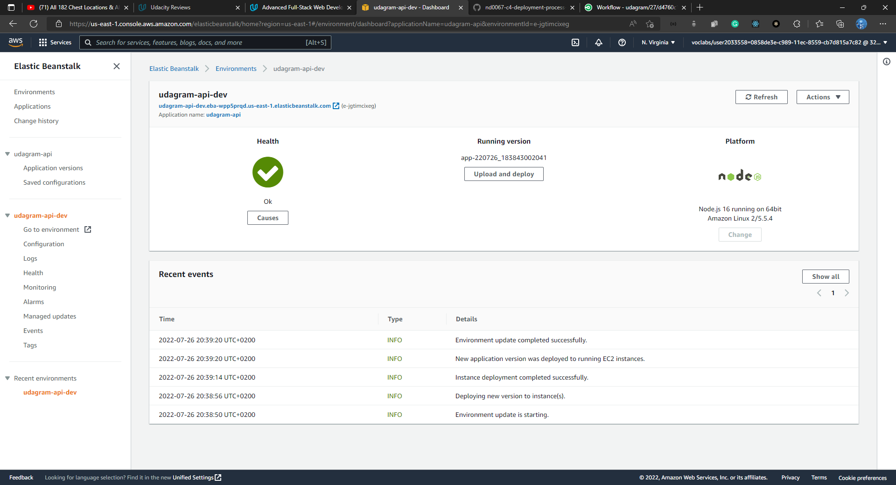

# AWS Cycle

in AWS, we will deploy our project nn different services and make connection between them

1. By Creating Database instance on RDS Service

__Here I created database instance called database-1__

2. Creating a Bucket in S3 Service to store the frontend for our app in it

__Here I created Bucket called dany-udagram__

3. Creating A New Environment on elastic beanstalk to save our app's back-end

__Here I created new environment which will run node for my server__

4. After That i updated Elastic Beanstalk environment variables to connect my database to my backend